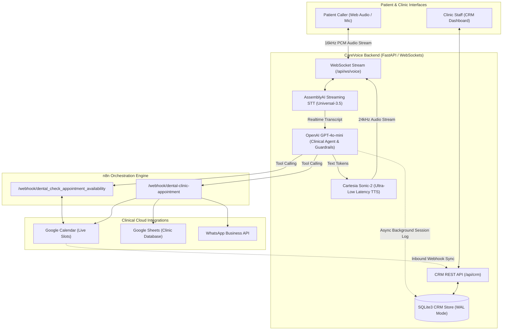

# CareVoice AI 🎙️🦷
### Autonomous Dental Clinic Voice Receptionist & Real-Time Operational CRM

> **CareVoice AI** is an intelligent, ultra-low latency healthcare voice AI receptionist and clinical operations platform built for dental practices. Powered by **AssemblyAI Real-Time WebSocket Streaming STT**, **OpenAI GPT-4o-mini**, **Cartesia Sonic-2 Voice Synthesis**, and an end-to-end automated **n8n Webhook, Google Calendar, Google Sheets & WhatsApp Notification Pipeline**, paired with an operational **Dental Clinic CRM & Admin Dashboard**.

---

## 🔑 Demo & Evaluation Credentials (For Hackathon Judges)

> [!IMPORTANT]
> **Evaluation Credentials**: The following live deployment links and credentials are provided strictly for hackathon evaluation and demonstration purposes.

* **Live Voice Receptionist (Patient Portal)**: [https://dental-care-ai-voice-agent-production.up.railway.app/](https://dental-care-ai-voice-agent-production.up.railway.app/)
* **Live Clinic Operations & CRM Dashboard**: [https://dental-care-ai-voice-agent-production.up.railway.app/dashboard/](https://dental-care-ai-voice-agent-production.up.railway.app/dashboard/)
* **Quick Clinic PIN Access**: `2026`
* **Admin Staff Login**: `admin@absolutedental.com`
* **Admin Password**: `AbsoluteDental2026!`
* **Inbound Calendar Sync Webhook**: `https://dental-care-ai-voice-agent-production.up.railway.app/api/crm/webhooks/google-calendar-sync`

---

## 🌟 Executive Summary & Problem Solved

Dental clinics and specialty practices lose over **30% of incoming patient bookings** due to missed calls after hours, staff overload during clinical procedures, and friction in scheduling.

**CareVoice AI** acts as a 24/7 autonomous front-desk receptionist named **Sophia** for **Absolute Dental** (Las Vegas, NV):
1. **Sub-200ms Full-Duplex Voice Conversations**: Human-like conversational fluidity powered by AssemblyAI Real-Time STT and Cartesia Sonic-2.
2. **Complete Appointment Lifecycle (Book, Reschedule & Cancel)**:
   - **New Bookings**: Checks live slot availability and books appointments directly via real-time tool calling (`dental_check_appointment_availability` and `dental-clinic-appointment`).
   - **Rescheduling**: Finds patient's existing appointment by name and phone, frees the old calendar slot, and seamlessly moves them to a new requested time.
   - **Cancellations**: Safely cancels bookings and updates clinic records.
3. **Instant WhatsApp Confirmation Notifications**: Automatically dispatches instant WhatsApp booking and rescheduling confirmation messages to patients with date, time, and clinic details via automated n8n workflows.
4. **Live Two-Way Calendar & EHR Sync**: Automatically synchronizes confirmed, rescheduled, and cancelled appointments with Google Calendar and Google Sheets in real time.
5. **Practice Management CRM & Operations Dashboard**: Provides clinic administrators with real-time operational insights, visual monthly booking calendars, AI call transcripts, patient logs, and conversation analytics.

---

## 🏗️ End-to-End System Architecture



---

## ⚡ Tech Stack

| Layer | Technology | Purpose |
| :--- | :--- | :--- |
| **Speech-to-Text (STT)** | **AssemblyAI Real-Time Streaming STT** | WebSocket 16kHz streaming transcription with immediate end-of-turn detection |
| **Reasoning Engine (LLM)** | **OpenAI GPT-4o-mini** | Low-latency clinical intent parsing, conversational guardrails, and tool calling |
| **Voice Synthesis (TTS)** | **Cartesia Sonic-2** *(Fallback: ElevenLabs / Deepgram)* | Sub-150ms voice generation with warm, professional healthcare tone and natural spoken time formatting |
| **Tool Automation Engine** | **n8n Production Webhooks (Railway)** | Autonomous calendar checks, multi-system appointment write-backs, and WhatsApp dispatch |
| **Backend & WebSockets** | **FastAPI + Uvicorn + WebSockets** | Asynchronous bi-directional audio pipeline and RESTful CRM API |
| **Database** | **SQLite3 (with thread-safe WAL mode)** | Local, persistent operational store for calls, appointments, and patient profiles |
| **Frontend Interfaces** | **HTML5, CSS3, Modern Vanilla JS** | 1. Patient Voice Portal (`/`)<br>2. Clinical Operations & CRM Dashboard (`/dashboard/`) |
| **Deployment** | **Docker + Railway Cloud** | Containerized unified single-service deployment with automatic HTTPS/WSS |

---

## 🚀 Key Features

### 1. Natural Voice Receptionist ("Sophia")
- **Full Appointment Lifecycle**:
  - **Book New Appointments**: Captures name, phone, date, time, reason for visit, and insurance.
  - **Reschedule Appointments**: Identifies existing bookings by patient name and phone number, frees the old slot, and rebooks at the new requested time.
  - **Cancel Appointments**: Safely removes cancellations from the active clinic roster.
- **Automated WhatsApp Confirmations**: Instantly triggers WhatsApp confirmation and reschedule alert messages to the patient.
- **Dynamic Barge-In Interruption**: Callers can interrupt Sophia at any moment; playback halts instantly within milliseconds and the agent listens.
- **Natural Spoken Time Formatting**: Speeds up and humanizes times (e.g. *"2 PM"*, *"11 AM"*, *"6:56 PM"*) without robotic *"two zero zero"* artifacts.
- **Automatic Call Hangup**: Detects natural conversational goodbyes (*"bye"*, *"goodbye"*, *"thank you"*) and cleanly disconnects after playing the farewell message.
- **Timezone-Aware Clinical Scheduling**: Evaluates dates and clinic hours grounded in Pacific Time (`America/Los_Angeles`).
- **Multilingual Support**: Speaks English and Spanish, understands Roman Urdu/Hindi.

### 2. Clinical Operations & Admin CRM Dashboard
- **Executive Metric Cards**: Real-time stats on total appointments, conversion rates, call minutes, patient inquiries, and pipeline health.
- **Operational Practice Grid (Calendar)**: Soft pastel color-coded appointment cards, right-aligned time stamps, and "TODAY" highlight badge.
- **Two-Way Real-Time Google Calendar Sync**: Webhook endpoint (`/api/crm/webhooks/google-calendar-sync`) keeps the dashboard in sync when events are added, edited, or deleted in Google Calendar.
- **AI Calls Table & Transcript Inspector**: Retell-style badges displaying execution status, payload details, latency, and full conversation transcripts.
- **Clean Slate Reset & Appointment Deletion**: 1-click single appointment deletion and complete test data purge for clean slate operation.
- **Role-Based PIN Security**: Protected with clinic PIN (`2026`) and staff password authentication.

---

## 📁 Repository Structure

```text
├── Dockerfile                  # Containerized deployment manifest
├── LICENSE                     # MIT License
├── README.md                   # Project documentation & architecture
├── requirements.txt            # Pinned runtime dependencies
├── .env.example                # Safe environment variables template
├── .gitignore                  # Ignored credentials, virtualenvs & databases
│
├── backend/
│   ├── main.py                 # FastAPI application entrypoint
│   ├── api/
│   │   ├── voice_routes.py     # WebSocket audio streaming endpoint (/api/ws/voice)
│   │   └── crm_routes.py       # CRM REST API & Calendar Webhook endpoints
│   ├── crm/
│   │   ├── auth.py             # Session token & PIN authentication
│   │   ├── db.py               # SQLite WAL-mode connection & schema manager
│   │   ├── crm_service.py      # Business logic, Google Calendar sync & background logging
│   │   └── seed_data.json      # Clean initialization template
│   ├── services/
│   │   ├── browser_voice_service.py # Full-duplex WebSocket STT -> LLM -> TTS engine
│   │   ├── deepgram_tts_service.py  # Deepgram Aura-2 fallback service
│   │   └── elevenlabs_service.py    # ElevenLabs Flash v2.5 fallback service
│   ├── tools/
│   │   └── appointment_tools.py# OpenAI function calling tools & n8n webhook callers
│   └── utils/
│       └── text_speech.py      # Natural spoken time and date normalization
│
├── frontend/
│   ├── index.html              # Patient voice caller web interface
│   ├── app.js                  # AudioContext microphone recorder & PCM player
│   └── dashboard/
│       ├── index.html          # Clinical CRM & Practice Management Dashboard
│       ├── dashboard.js        # Real-time polling, operational calendar & SVG charts
│       └── dashboard.css       # Clean medical SaaS design system
│
├── tests/
│   ├── unit/
│   │   ├── test_dental_setup.py # Schema & prompt verification tests
│   │   ├── test_clean_text.py   # Spoken text normalization tests
│   │   └── test_gcal_parser.py  # Google Calendar event parser tests
│   └── integration/
│       ├── test_crm_gcal_sync.py      # Database two-way sync tests
│       ├── test_clinicappointment.py  # n8n booking & cancellation tests
│       └── test_cartesia_speed.py     # TTS latency benchmark
│
└── legacy/
    ├── README.md               # Explanation of deprecated CLI prototype
    └── agent_terminal_pyaudio.py # Early desktop PyAudio CLI script
```

---

## 🛠️ Installation & Setup

### 1. Prerequisites
- Python 3.10+
- Modern Web Browser (Chrome / Edge / Safari / Firefox) with microphone permissions enabled

### 2. Clone & Environment Setup
```bash
git clone https://github.com/Mahinn849/dental-care-ai-voice-agent.git
cd dental-care-ai-voice-agent

# Create virtual environment
python -m venv .venv

# Activate environment (Windows)
.venv\Scripts\activate

# Activate environment (Mac/Linux)
source .venv/bin/activate

# Install dependencies
pip install -r requirements.txt
```

### 3. Configure API Keys
Copy the example environment template:
```bash
cp .env.example .env
```
Fill in your API credentials:
```env
# AssemblyAI (Required for Streaming STT)
ASSEMBLYAI_API_KEY="your_assemblyai_api_key_here"

# OpenAI (Required for LLM reasoning & function calling)
OPENAI_API_KEY="your_openai_api_key_here"

# Cartesia (Required for ultra-low latency TTS)
CARTESIA_API_KEY="your_cartesia_api_key_here"
CARTESIA_VOICE_ID="db6b0ed5-d5d3-463d-ae85-518a07d3c2b4"

# Fallback TTS Providers (Optional)
DEEPGRAM_API_KEY="your_deepgram_api_key_here"
DEEPGRAM_TTS_MODEL="aura-2-helena-en"
ELEVENLABS_API_KEY="your_elevenlabs_api_key_here"
ELEVENLABS_VOICE_ID="SAz9YHcvj6GT2YYXdXww"

# n8n Webhook Configuration (Deployed on Railway)
N8N_BASE_URL="https://primary-production-930a9.up.railway.app"
N8N_DENTAL_CHECK_AVAILABILITY_WEBHOOK_URL="https://primary-production-930a9.up.railway.app/webhook/dental_check_appointment_availability"
N8N_DENTAL_CLINIC_APPOINTMENT_WEBHOOK_URL="https://primary-production-930a9.up.railway.app/webhook/dental-clinic-appointment"

# CRM Admin Credentials
CRM_ADMIN_USER="admin@absolutedental.com"
CRM_ADMIN_PASS="AbsoluteDental2026!"
CRM_ADMIN_PIN="2026"
```

### 4. Run the Platform Locally
Start the unified FastAPI server:
```bash
python -m uvicorn backend.main:app --host 0.0.0.0 --port 8000 --reload
```

Once running, access:
- **Patient Voice Caller Interface**: [http://localhost:8000/](http://localhost:8000/)
- **Dental Clinic CRM & Admin Dashboard**: [http://localhost:8000/dashboard/](http://localhost:8000/dashboard/) *(PIN: `2026`)*

---

## 🧪 Automated Test Suite

Run the automated test suite locally:
```bash
# 1. Run Unit Tests (Tool Schemas, Spoken Text Normalization, Calendar Parser)
python tests/unit/test_dental_setup.py
python tests/unit/test_clean_text.py
python tests/unit/test_gcal_parser.py

# 2. Run Integration Tests (CRM Two-Way Calendar Sync)
python tests/integration/test_crm_gcal_sync.py
```

---

## ☁️ Deployment (Railway)

CareVoice AI is container-ready with the root `Dockerfile`:
1. Connect this GitHub repository (`dental-care-ai-voice-agent`) to [Railway](https://railway.app).
2. Add your environment variables in the **Variables** tab (`ASSEMBLYAI_API_KEY`, `OPENAI_API_KEY`, `CARTESIA_API_KEY`, etc.).
3. Under **Settings -> Networking**, click **Generate Domain**.
4. Both the **Voice Agent** (`/`) and **CRM Dashboard** (`/dashboard/`) are live on public HTTPS/WSS immediately!

---

## 🔒 Security & Privacy Notes

- **Secrets Isolation**: All API credentials and keys are strictly loaded via environment variables (`.env`) and are ignored by `.gitignore`. No live credentials are committed to version control.
- **CORS Hardening**: Wildcard CORS is enabled for hackathon demo compatibility. Production deployments should restrict `allow_origins` to specific healthcare clinic domain names.
- **Evaluation Credentials**: Credentials provided in this documentation (`2026` / `admin@absolutedental.com`) are configured exclusively for hackathon evaluation and demonstration purposes.

---

## ⚕️ Healthcare & Compliance Disclaimer

CareVoice AI is a technology demonstration and hackathon prototype developed to illustrate conversational AI capabilities for dental practice reception, appointment scheduling, and operational tracking. It is **not** certified under HIPAA, HITECH, or FDA medical device regulations. It is designed to assist with administrative scheduling and general clinic inquiries, and is not intended to provide clinical diagnoses, triage emergency conditions, or offer medical advice. Production deployments in healthcare environments require dedicated compliance controls, business associate agreements (BAAs), and end-to-end data encryption.

---

## 📄 License
This project is licensed under the MIT License - see the [LICENSE](LICENSE) file for details.
